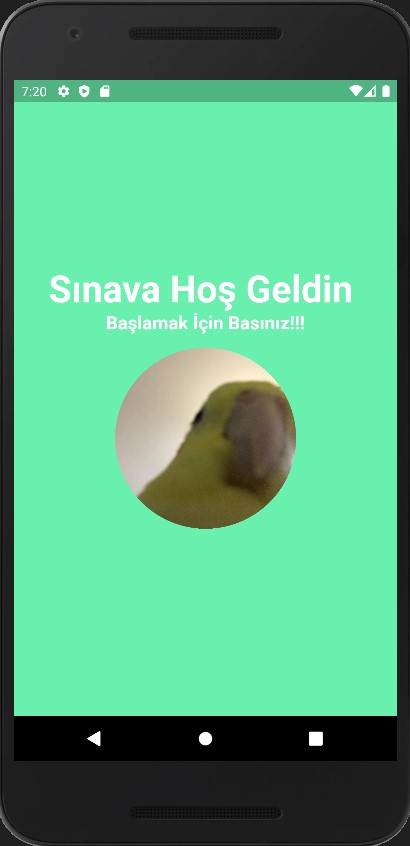
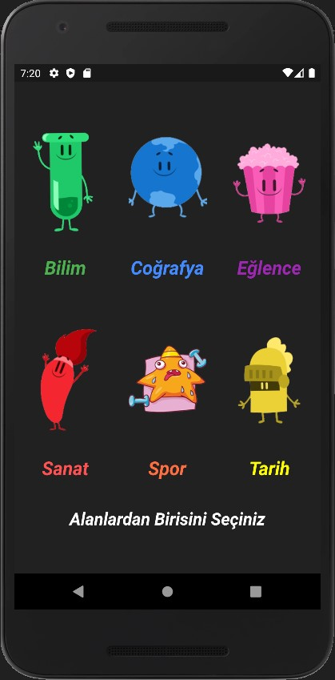
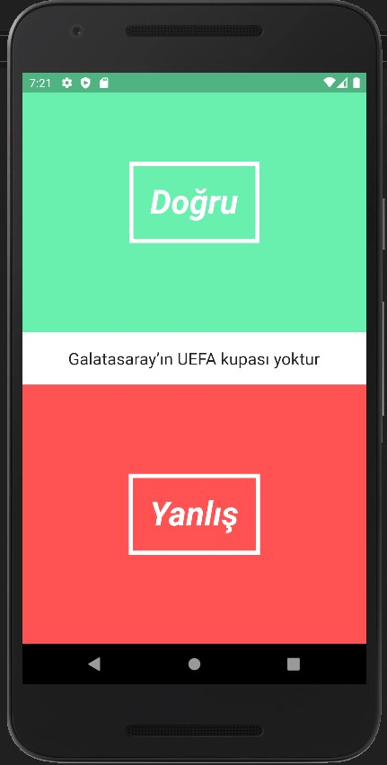

# Flutter Dart Sınav Uygulaması

Yarattığım uygulama bir sınav uygulaması olmakta ve ismi de Quiz’dir.Uygulama bir çok animasyon hareket içermektedir. Uygulamanın içerisinde 4 tane ana bileşen
sayfa vardır. Bunun dışında ki sayfalar QuizPage sayfasının kopyasıdır. Kullanıcı ara yüzü tasarımını ( UI ) geliştirmek amacıyla açılmış olan 3 tane dart dosyası
mevcuttur. Items adında bir klasörüm var ve bu klasörün içeriğinde class ve ayrı ayrı metotları içeren 2 adet dart dosyası mevcuttur. Uygulamayı geliştirirken
kullanmış olduğum png dosyaları da images klasörünün altındadır. Son olarak da geriye logo için kullandığım icon ve Main.dart dosyası kaldı. Onlarda direkt ana 
dizinin altında mevcuttur. Geliştirdiğim uygulama tamamen bütün platformlara duyarlıdır. Hiçbir şekilde piksel taşma sorunu veya mantıksal hata bulunmamaktadır.
Kod satırlarının açıklamaları bulunmaktadır. 

Uygulamanın tam hali için;

### Benimle İletişime Geç

&nbsp;&nbsp;

&nbsp;&nbsp;

# Tasarım 

&nbsp;&nbsp;

&nbsp;&nbsp;

&nbsp;&nbsp;
